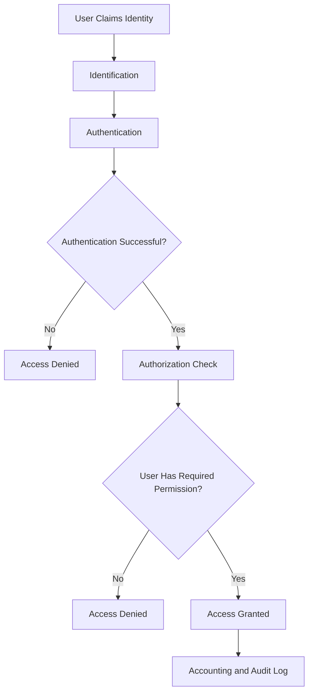

# Basic IAM Flow

```mermaid
flowchart TD
    A[User Claims Identity] --> B[Identification]
    B --> C[Authentication]
    C --> D{Authentication Successful?}
    D -- No --> E[Access Denied]
    D -- Yes --> F[Authorization Check]
    F --> G{User Has Required Permission?}
    G -- No --> H[Access Denied]
    G -- Yes --> I[Access Granted]
    I --> J[Accounting and Audit Log]
```
