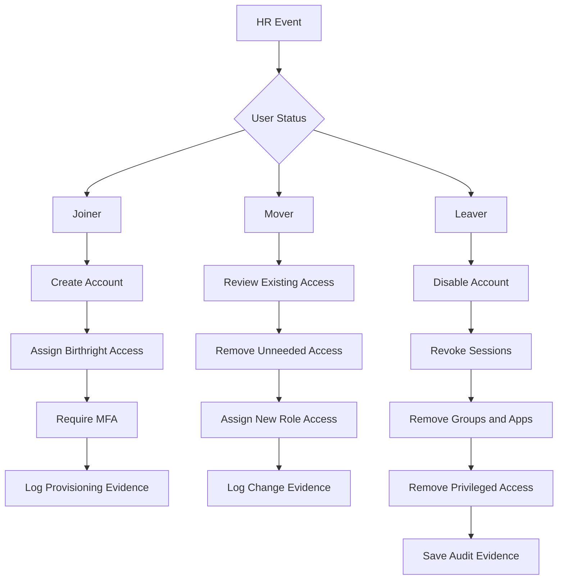

# Joiner-Mover-Leaver Workflow

```mermaid
flowchart TD
    A[HR Event] --> B{User Status}
    B --> C[Joiner]
    B --> D[Mover]
    B --> E[Leaver]

    C --> F[Create Account]
    F --> G[Assign Birthright Access]
    G --> H[Require MFA]
    H --> I[Log Provisioning Evidence]

    D --> J[Review Existing Access]
    J --> K[Remove Unneeded Access]
    K --> L[Assign New Role Access]
    L --> M[Log Change Evidence]

    E --> N[Disable Account]
    N --> O[Revoke Sessions]
    O --> P[Remove Groups and Apps]
    P --> Q[Remove Privileged Access]
    Q --> R[Save Audit Evidence]
```
