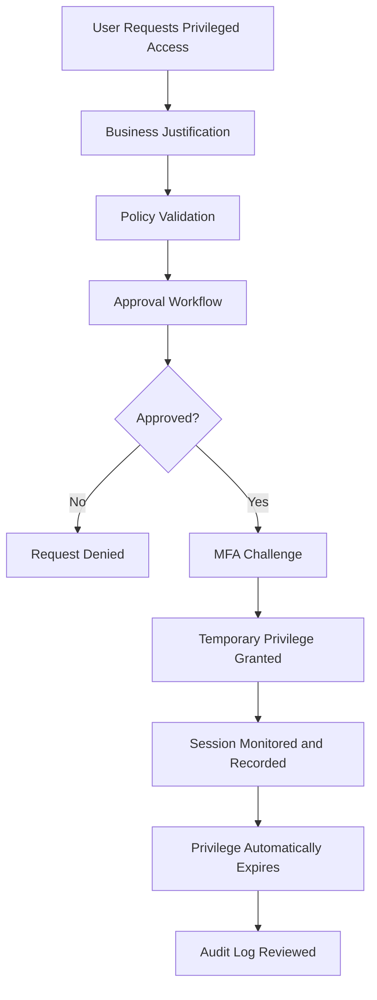

# PAM Access Request Workflow

```mermaid
flowchart TD
    A[User Requests Privileged Access] --> B[Business Justification]
    B --> C[Policy Validation]
    C --> D[Approval Workflow]
    D --> E{Approved?}
    E -- No --> F[Request Denied]
    E -- Yes --> G[MFA Challenge]
    G --> H[Temporary Privilege Granted]
    H --> I[Session Monitored and Recorded]
    I --> J[Privilege Automatically Expires]
    J --> K[Audit Log Reviewed]
```
